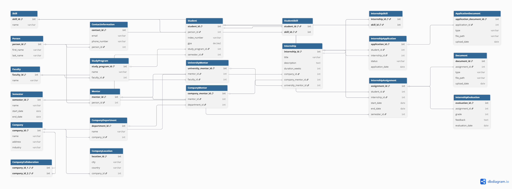
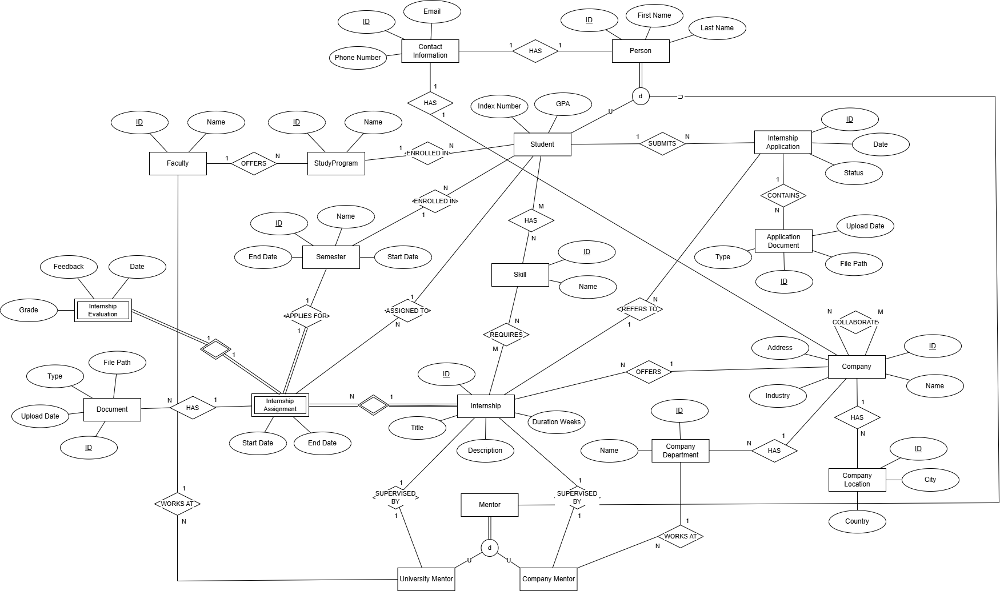

# Internship Management Database (PostgreSQL)

A relational database–centric project for managing student internships.  
The system models persons, students, mentors, study programs, faculties,
companies, internships, applications, assignments, evaluations, skills,
and related documents.

The project emphasizes correct relational modeling, strong data integrity
enforcement, and measurable performance considerations using PostgreSQL.

---

## Features

- Fully normalized relational schema (3NF)
- Clear separation between:
  - Persons, students, and mentors
  - Internship applications, assignments, and evaluations
- Support for:
  - University and company mentors
  - Skills linked to students and internships
  - Company departments and locations
- Integrity enforced at the database level using:
  - Primary and foreign keys
  - Unique and check constraints
  - Triggers for business rules
- Analytical SQL reports using JOINs, aggregation, and CTEs
- Secondary indexing with before-and-after performance comparison
- Demonstrations of constraint and trigger behavior

---

## Project Structure

```
internship-management-system/
├── sql/ # Schema, Views, Triggers, Indexes, and Reports
├── diagrams/ # Conceptual EER and Logical Schema diagrams
├── performance/ # Indexing discussion and performance screenshots
├── verification/ # Constraint, Trigger, Report, and View checks
└── README.md
```


---

## SQL Scripts Execution Order

The SQL scripts in the `sql/` folder are numbered and should be executed in the following order:

1. **01_schema.sql**  
   Creates all tables, primary keys, foreign keys, and constraints.

2. **02_views.sql**  
   Defines read-only database views used for simplified access and reporting.

3. **03_triggers.sql**  
   Defines triggers that enforce business rules at the database level.

4. **04_load.sql**  
   Inserts a small, fixed dataset for functional testing.

5. **05_indexes.sql**  
   Creates secondary indexes used to optimize JOINs and reporting queries.

6. **06_reports.sql**  
   Contains analytical and reporting SQL queries.

7. **07_dynamic_load.sql**  
   Generates large volumes of synthetic data for performance testing.

Each script is designed to be safely re-runnable by clearing or truncating
relevant data beforehand.

---

## Diagrams

The `diagrams/` folder contains:

- A **Logical schema diagram** showing tables, attributes, and foreign key relationships
- A **Conceptual EER diagram** showing entities, relationships, and cardinalities

The diagrams are consistent with the implemented SQL schema.

### Logical Schema


### Conceptual EER Diagram


---

## Performance Analysis

The `performance/` folder includes:

- Written discussion of index design decisions
- Query execution time comparisons with and without indexes
- Observations on the impact of indexing versus aggregation cost

Performance testing was conducted using dynamically generated datasets.

---

## Demonstrations

The `verification/` folder contains screenshots demonstrating:

- Enforcement of unique and check constraints
- Trigger-based prevention of invalid operations
- Correct behavior of reports and database views

These demonstrations confirm that business rules and data integrity
are enforced directly by the database.
