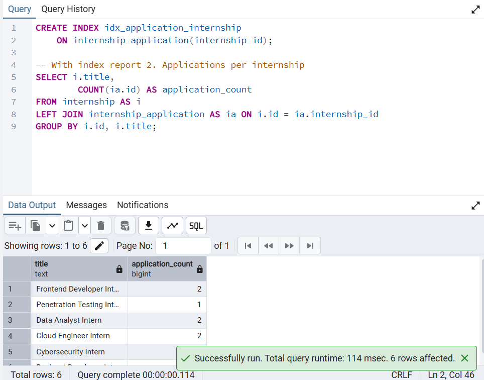
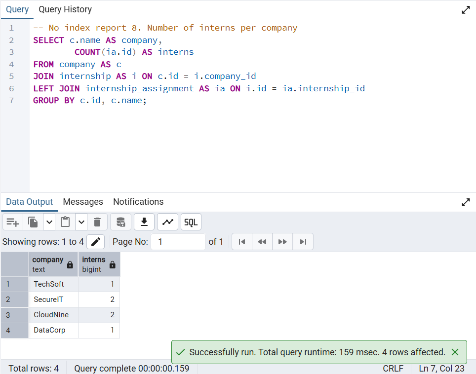
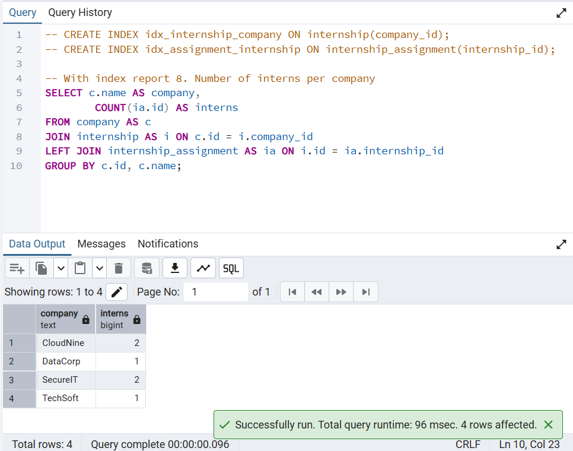
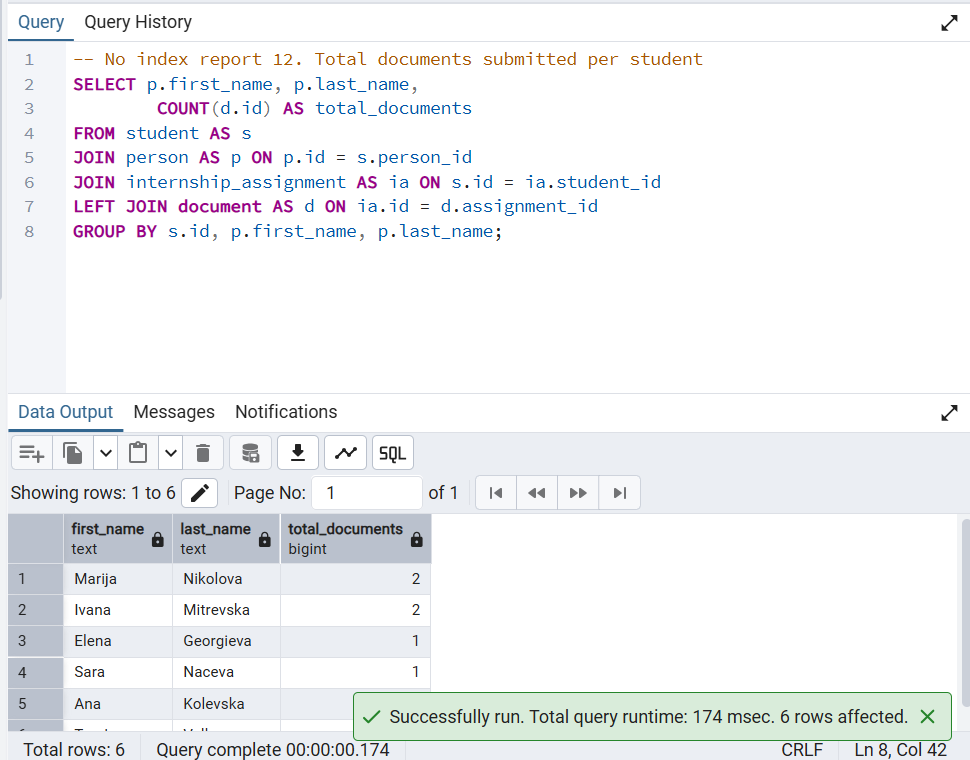
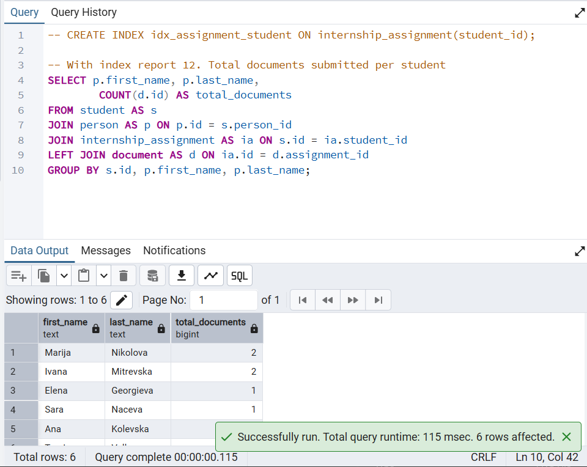
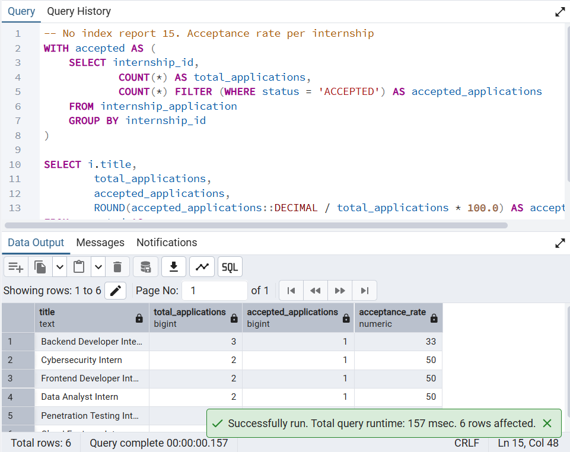
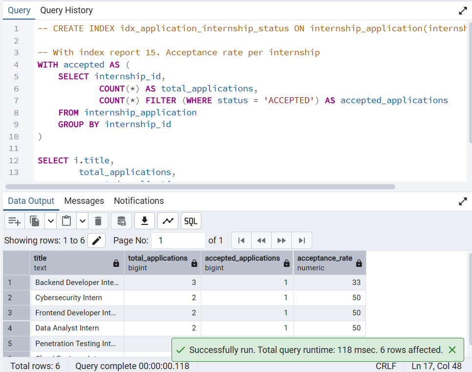
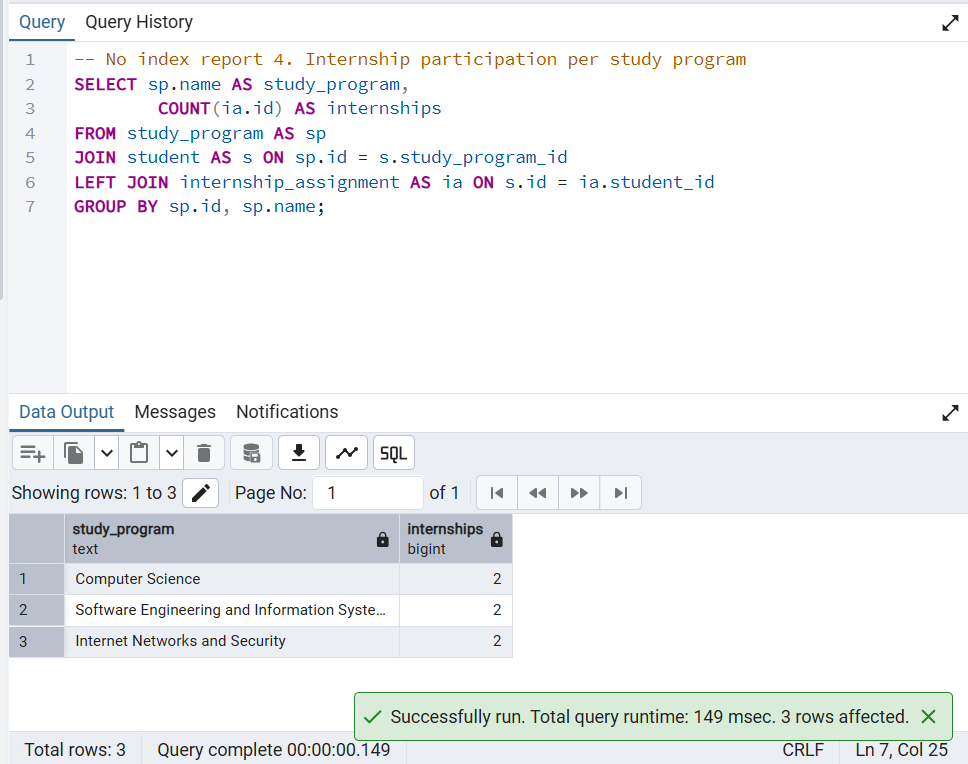
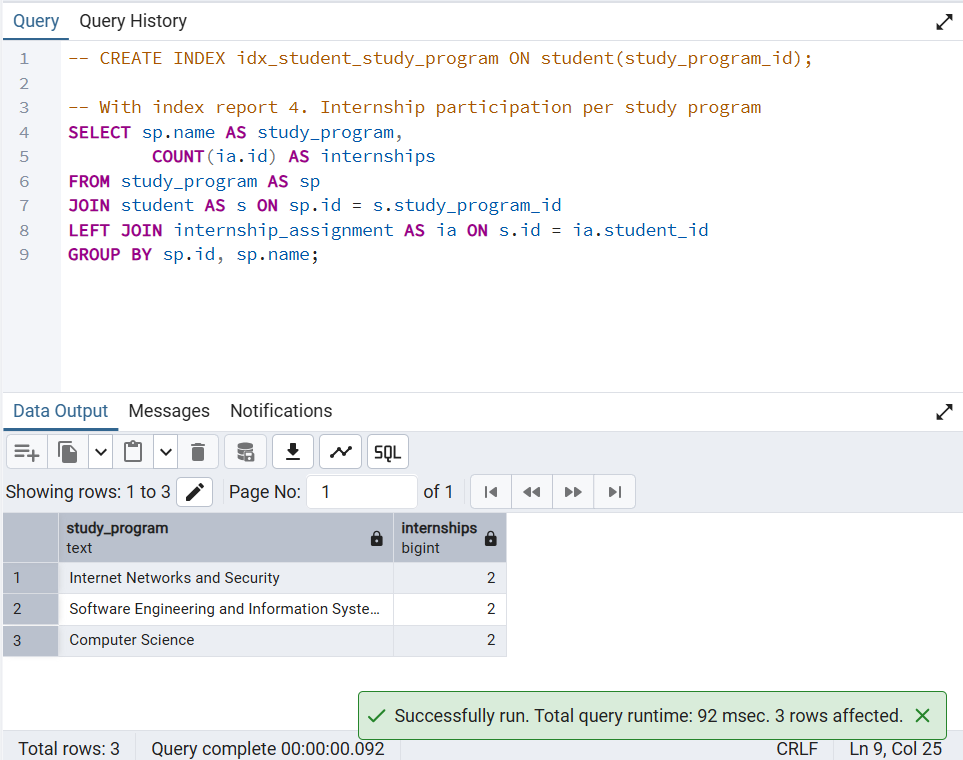

# Internship Database – Query Performance Screenshots

## Report 2 – Applications per Internship
**Without index**

**With index**

---

## Report 8 – Number of Interns per Company
**Without index**

**With index**

---

## Report 12 – Total Documents Submitted per Student
**Without index**

**With index**

---

## Report 15 – Acceptance Rate per Internship
**Without index**

**With index**

---

## Report 4 – Internship Participation per Study Program
**Without index**

**With index**

