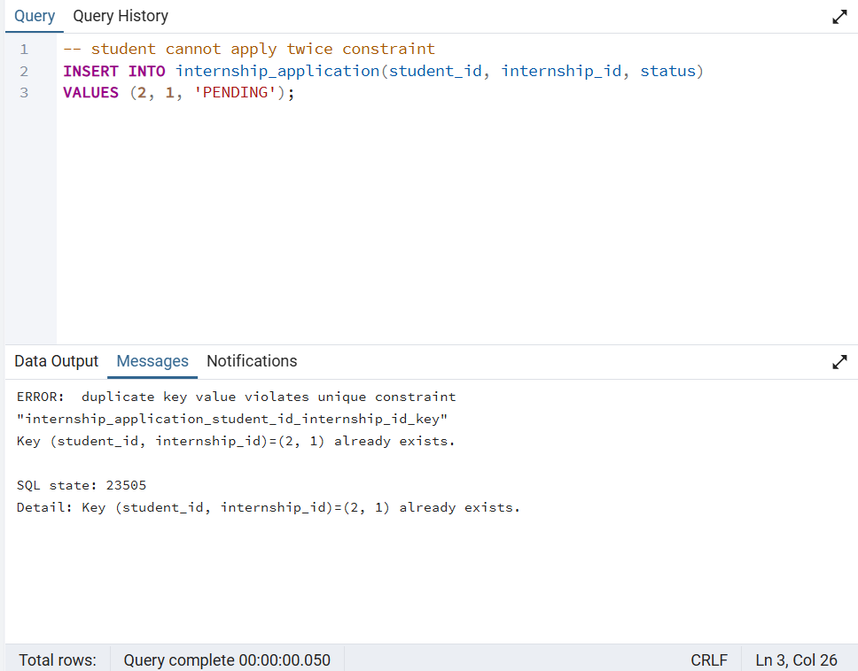
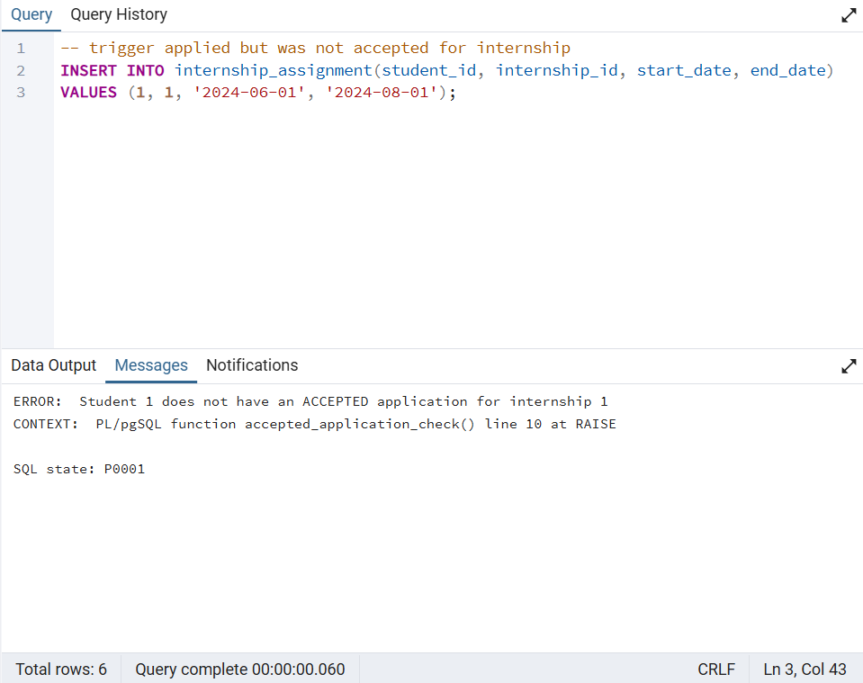
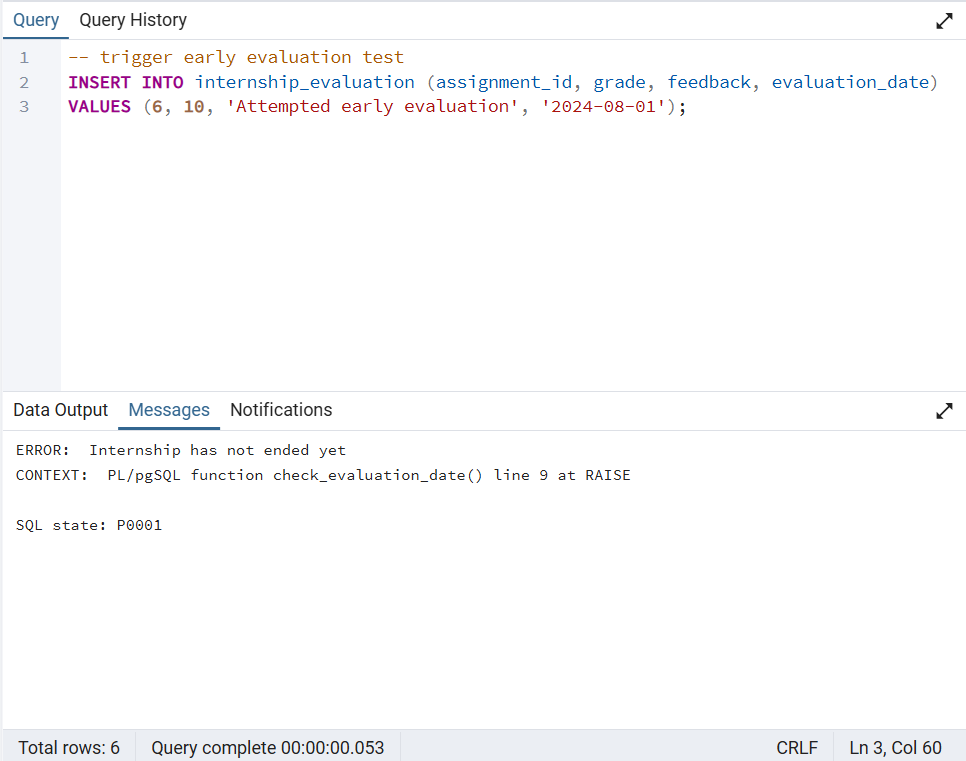
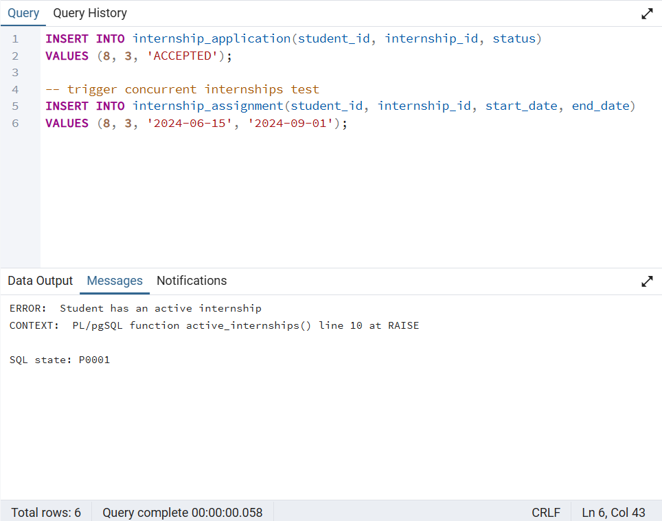
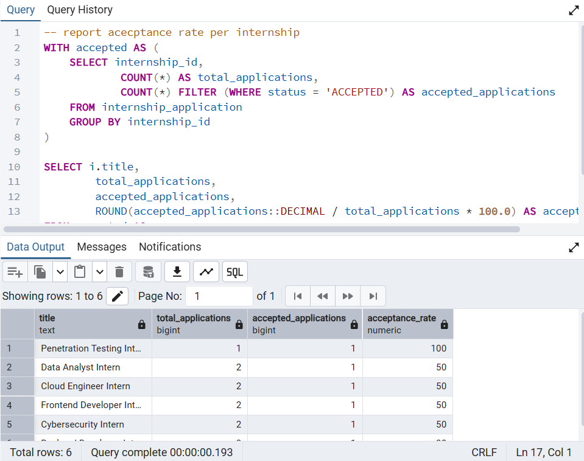
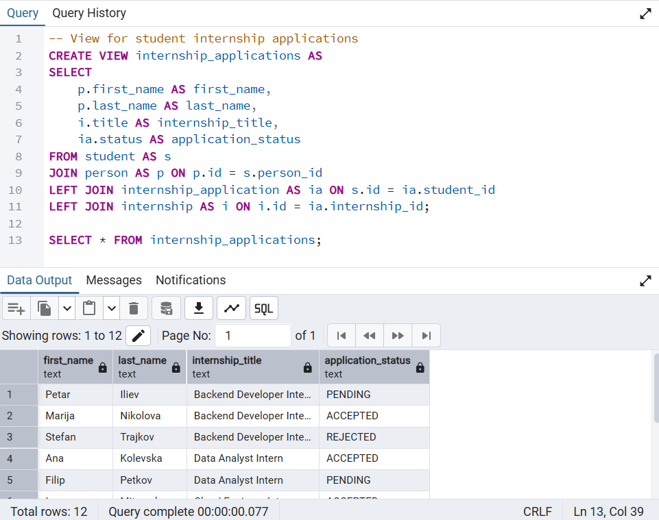

# Database Integrity & Behavior Verification

This folder contains **visual verification** that the database correctly enforces
integrity constraints, business rules, and expected behavior.

Each screenshot shows an intentional attempt to violate a rule (or exercise a report/view),
along with the database response. All enforcement is implemented **at the database level**
using constraints, triggers, and views.

---

## Constraint Verification

### Unique Application Constraint

**Rule:**  
A student cannot apply to the same internship more than once.

**Result:**  
The database rejects duplicate `(student_id, internship_id)` pairs via a unique constraint.

---

## Trigger Verification

### Assignment Requires Accepted Application

**Rule:**  
A student may only be assigned to an internship if their application status is `ACCEPTED`.

**Result:**  
The trigger prevents creating an assignment when the application is not accepted.

---

### Prevent Early Internship Evaluation

**Rule:**  
An internship evaluation cannot be inserted before the internship end date.

**Result:**  
The trigger rejects evaluations submitted before the internship has ended.

---

### Prevent Multiple Concurrent Internships

**Rule:**  
A student cannot have overlapping internship assignments.

**Result:**  
The trigger rejects assignments that overlap with an existing active internship.

---

## Report and View Verification

### Acceptance Rate Report

**Purpose:**  
Verify correct computation of acceptance rates per internship using aggregation
and conditional counting.

**Result:**  
The report correctly displays total applications, accepted applications,
and calculated acceptance rates.

---

### Internship Applications View

**Purpose:**  
Verify correct behavior of the `internship_applications` view, which summarizes
student applications and their statuses.

**Result:**  
The view correctly joins students, internships, and application statuses.

---

## Summary

These checks demonstrate that:

- Integrity rules are enforced using constraints.
- Business rules are enforced using triggers.
- Reports and views behave as designed.
- Invalid operations are rejected by the database itself.

No application-layer logic is required.